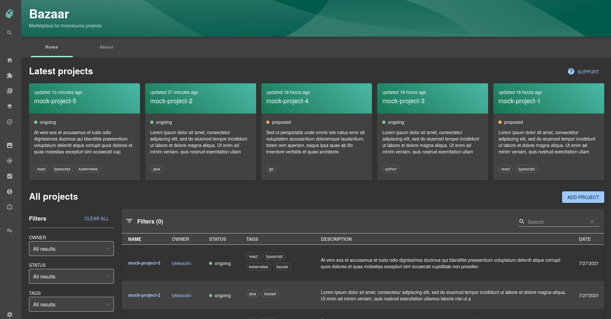
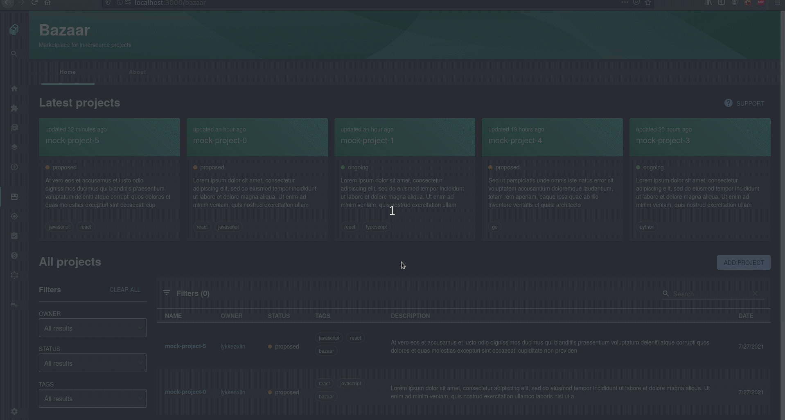
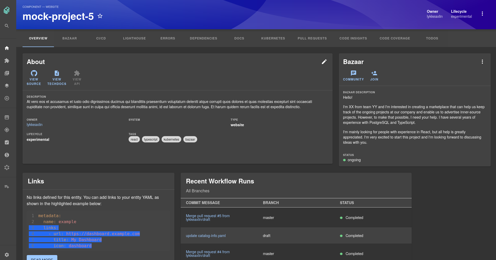

# [Plugin] Bazaar

## Introduction
This is the first draft of the Bazaar plugin that was suggested in [#5963](https://github.com/backstage/backstage/issues/5963).

#### What is the Bazaar?

The Bazaar is a place where teams can propose projects for cross-functional team development. Essentially a marketplace for internal projects suitable for [Inner Sourcing](https://en.wikipedia.org/wiki/Inner_source). With "Inner Sourcing", we mean projects that are developed internally within a company, but with Open Source best practices.

#### Why?

Many companies today are of high need to increase the ease of cross-team cooperation. In large organizations, engineers often have limited ways of discovering or announcing the projects which could benefit from a wider development effort in terms of different expertise, experiences, and teams spread across the organization. With no good way to find these existing internal projects to join, the possibility of working with Inner Sourcing practices suffers.

#### How?

The Bazaar allows engineers and teams to open up and announce their new and exciting projects for transparent cooperation in other parts of larger organizations. The Bazaar ensures that new Inner Sourcing friendly projects gain visibility through Backstage and a way for interested engineers to show their interest and in the future contribute with their specific skill set. The Bazaar also provides an easy way to manage, catalog, and browse these Inner Sourcing friendly projects and components.

## How does the Bazaar work?

The latest modified Bazaar projects are displayed in the Bazaar landing page, located at the Bazaar icon in the sidebar. Below the project bar there is a catalog, like the one in Backstage, but it only contains Bazaar projects.

**Adding a project to the Bazaar**:

To add a project to the Bazaar, you need to create a project with one of the templates in Backstage. In addition, the project needs to have at least two branches on GitHub because modifications are done through pull requests.

When adding a project to the Bazaar, you will be asked to add a Bazaar description, i.e. an announcement for new team members. The purpose of the announcement is for you to present your ideas and what skills you are looking for. The Bazaar information is added to the `catalog-info.yaml` file and once the pull request is merged you will find the newly added project in the Bazaar.

When a project has been added to the Bazaar it will be provided with an additional 'Bazaar' card on its Entity Page.

**Editing or removing the Bazaar information of a project**:

The project can be editied or removed from the Bazaar card on the Entity Page. Similarly to adding a project, editing or removing a Bazaar project will create a pull request.

### TODOS:

**We are planning on implementing the following features, what do you think?** Comments and suggestions are greatly appreciated.

- Bazaar landing page

  - Add a tab 'My page', where your personal data is displayed. For example: your projects and its latest activities, projects or tags you are following etc.
  - Display the number of members for each project on the project card

- Bazaar card

  - Make it possible to join a project by clicking the 'join' icon
  - Display the latest members that have joined the project
  - Make it possible to follow tags/projects

- Bazaar tab on the EntityPage

  - Fill Bazaar-tab with more content, for example images and achivements
  - Show all the members that have joined the project

- Dialogs

  - Extend the dialog for adding a project with more fields, e.g. chat link and the possibility to add images

- Testing
  - Add tests to all Bazaar components
  - Add test to util functions

#### :heavy_check_mark: Checklist

- [ ] A changeset describing the change and affected packages. ([more info](https://github.com/backstage/backstage/blob/master/CONTRIBUTING.md#creating-changesets))
- [x] Added or updated documentation
- [ ] Tests for new functionality and regression tests for bug fixes
- [x] Screenshots attached (for UI changes)
- [x] All your commits have a `Signed-off-by` line in the message. ([more info](https://github.com/backstage/backstage/blob/master/CONTRIBUTING.md#developer-certificate-of-origin))
